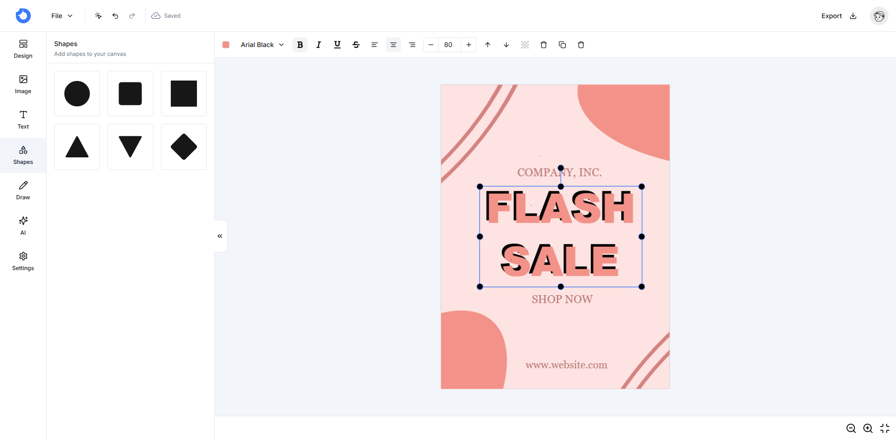

# Image AI - AI 驱动的图片编辑器

Image AI 是一个功能强大的在线图片编辑器,集成了 AI 图片生成、背景移除等功能。它使用 Next.js 构建,提供直观的用户界面和丰富的编辑工具。


## ✨ 主要功能

- 🎨 完整的图片编辑功能
  - 添加文字、形状
  - 调整颜色、大小
  - 图层管理
  - 绘图工具
- 🤖 AI 功能
  - AI 图片生成
  - 智能背景移除
- 📦 模板系统
  - 内置多种设计模板
  - 支持自定义模板
- 💾 多种导出格式
  - PNG
  - JPG 
  - SVG
  - JSON(用于后续编辑)



## 🚀 快速开始

### 在线使用

访问 [Image AI](https://www.imagegicai.com/) 即可开始使用。

### 本地开发

1. 克隆项目:
   ```bash
   git clone https://github.com/zhengchchen/image-ai.git
   cd image-ai
   ```
2. 安装依赖:
   ```bash
   pnpm install
   ```

3. 配置环境变量:

    复制 `.env.example` 为 `.env.local` 并填写必要的环境变量:
    ```bash
    cp .env.example .env.local
    ```
    需要配置的环境变量包括:

   - `DATABASE_URL`: 数据库连接地址
   - `NEXTAUTH_SECRET`: NextAuth 密钥
   - `UPLOADTHING_SECRET`: UploadThing 密钥
   - `UPLOADTHING_APP_ID`: UploadThing 应用 ID
   - `REPLICATE_API_TOKEN`: Replicate API 密钥

4. 启动开发服务器:
   ```bash
   pnpm dev
   ```
    访问 [http://localhost:3000](http://localhost:3000) 查看结果。

## 🛠 技术栈

- [Next.js 14](https://nextjs.org/) - React 框架
- [TypeScript](https://www.typescriptlang.org/) - 类型检查
- [Tailwind CSS](https://tailwindcss.com/) - 样式
- [Fabric.js](http://fabricjs.com/) - 画布操作
- [Drizzle ORM](https://orm.drizzle.team/) - 数据库 ORM
- [NextAuth.js](https://next-auth.js.org/) - 身份认证
- [Replicate](https://replicate.com/) - AI 功能
- [UploadThing](https://uploadthing.com/) - 文件上传
- [Neon Database](https://neon.tech/) - PostgreSQL 数据库

## 📦 项目结构
    src/
    ├── app/ # Next.js 应用路由
    ├── components/ # 通用组件
    ├── db/ # 数据库 schema 定义
    ├── hooks/ # 自定义 hooks
    ├── features/ # 功能模块
    │ ├── editor/ # 编辑器核心功能
    │ ├── ai/ # AI 相关功能
    │ ├── auth/ # 认证相关
    │ └── projects/ # 项目管理
    └── lib/ # 工具函数和配置

## 📄 License

MIT License - 查看 [LICENSE](LICENSE) 文件了解详情

## 🤝 贡献指南

欢迎提交 Issue 和 Pull Request!

1. Fork 项目
2. 创建功能分支 (`git checkout -b feature/AmazingFeature`)
3. 提交改动 (`git commit -m 'Add some AmazingFeature'`)
4. 推送到分支 (`git push origin feature/AmazingFeature`)
5. 提交 Pull Request

## 📧 联系方式

[275781239@qq.com](mailto:275781239@qq.com)

## 🙏 致谢

感谢以下开源项目:

- [Next.js](https://nextjs.org/)
- [Fabric.js](http://fabricjs.com/)
- [shadcn/ui](https://ui.shadcn.com/)
- [Replicate](https://replicate.com/)